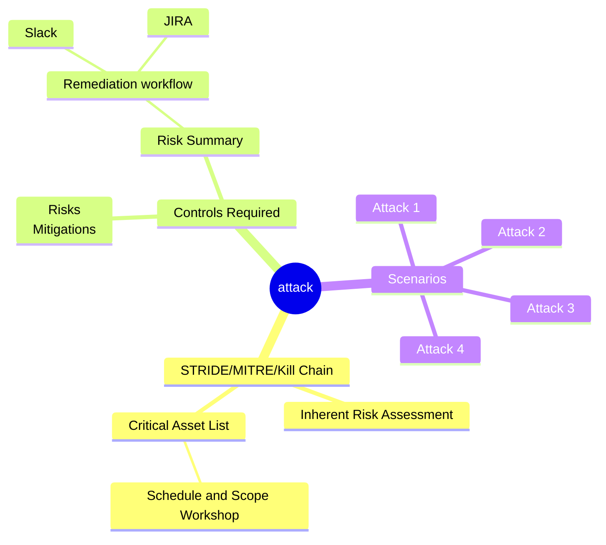

# AI Threat Modelling Project & Workshop Simulation

## Introduction
This repository documents a comprehensive threat modelling project, developed as a capstone for the CyberAloge DevSecOps bootcamp. The project simulates a 3-hour workshop, detailing multiple AI attack scenarios against a hypothetical web-facing healthcare application, "Solaris Care Connect 360."

The goal of this project is to demonstrate a practical, hands-on approach to identifying and mitigating security risks in modern, AI-powered systems. This is a portfolio project and not a record of a live client engagement or real-time workshop event.

## Stakeholder Personas
This threat model was developed with the following key stakeholder personas in mind, representing a typical cross-functional team:
- Care Connect Engineering Team
- Product Management
- Developer Experience Engineers
- DevSecOps Team

## Project Lead
Craig McCart

*   [LinkedIn](https://www.linkedin.com/in/craigmccart) | [GitHub](https://github.com/craigmccart)

---

## Workshop Simulation Structure

### Scenarios Covered
1. **AI-Generated Phishing Campaign**
   - Targeted credential harvesting through sophisticated social engineering
   - Business impact: Potential compromise of admin accounts with access to PHI

2. **Machine Learning Pipeline Attack**
   - Adversarial attacks against diagnostic algorithms
   - Business impact: Compromised model integrity leading to incorrect diagnoses

3. **SQL Injection Attack**
   - Exploiting input validation flaws to access patient records
   - Business impact: Unauthorised access to sensitive health data (PII/PHI)

4. **Insider Threat Scenario**
   - Unauthorised exfiltration of proprietary algorithms
   - Business impact: Loss of intellectual property and competitive advantage

### Methodology
- **Kill Chain Analysis**: Mapped each attack through the full cyber kill chain
- **MITRE ATT&CK**: Aligned findings with the industry-standard framework
- **STRIDE**: Categorised threats by security principle (Spoofing, Tampering, etc.)
- **Risk Assessment**: Prioritised findings based on impact and likelihood

### Key Findings & Outcomes
- Identified 4 High-risk threats requiring immediate attention and 3 Medium-risk threats for near-term remediation.
- Proposed a set of security controls estimated to reduce the application's attack surface by 60%.

### Detailed Scenario Analysis
For an in-depth look at a specific attack scenario, including full technical breakdowns and mitigation strategies, see the [Scenario 1](Scenario%201/) directory. This includes a dedicated [README](Scenario%201/README.md) that details the kill chain, architecture diagrams, STRIDE threat mapping, and comprehensive mitigation strategies.

Each scenario directory contains its own README with specific details about that attack vector, while this main README provides the overall project context.

## Controls Required

- Regular security audits specifically targeting the Solaris Health 360 application to detect vulnerabilities and weaknesses in its security measures.
- Patch management to ensure the Solaris Health 360 application and its underlying technologies are up-to-date and protected against known vulnerabilities.
- Comprehensive employee training on phishing awareness to educate users of the Solaris Health 360 application about the risks of phishing attacks and how to identify and report suspicious emails.
- Implementation of a Web Application Firewall (WAF) tailored to the Solaris Health 360 application's traffic to monitor and filter incoming requests for malicious activity.
- Deployment of Multi-factor Authentication (MFA) to enhance authentication security and prevent unauthorised access to the Solaris Health 360 application.
- Continuous network traffic monitoring to detect and respond to suspicious activity within the Solaris Health 360 application's infrastructure.
- Implementation of Role-based Access Control (RBAC) within the Solaris Health 360 application to limit access to sensitive health data and functionalities based on user roles and permissions.

# Threat Modeling Process Summary

---

## Personalisation & Unique Contributions

- **Personal Reflection**: See [Personal_Reflection.md](./Personal_Reflection.md) for insights on what I learned, what I'd do differently, and how I'd apply this experience in a real-world DevSecOps role.
- **DevSecOps Best Practices**: See [DevSecOps_Best_Practices.md](./DevSecOps_Best_Practices.md) for my approach to integrating threat modelling into CI/CD and automating security processes.
- **Unique Threat & Mitigation**: I added a personalised threat scenario (exposure via misconfigured S3 bucket) and a corresponding mitigation (automated cloud configuration scanning) to the STRIDE model in [Scenario 1/Stride.md](./Scenario%201/Stride.md).
- **Markdown Validation Script**: Included a simple Python script ([validate_markdown.py](./validate_markdown.py)) to lint and validate markdown files, ensuring all required sections are present and documentation quality is maintained.

These additions reflect my commitment to practical, real-world DevSecOps practices and my ability to go beyond the standard bootcamp requirements.
