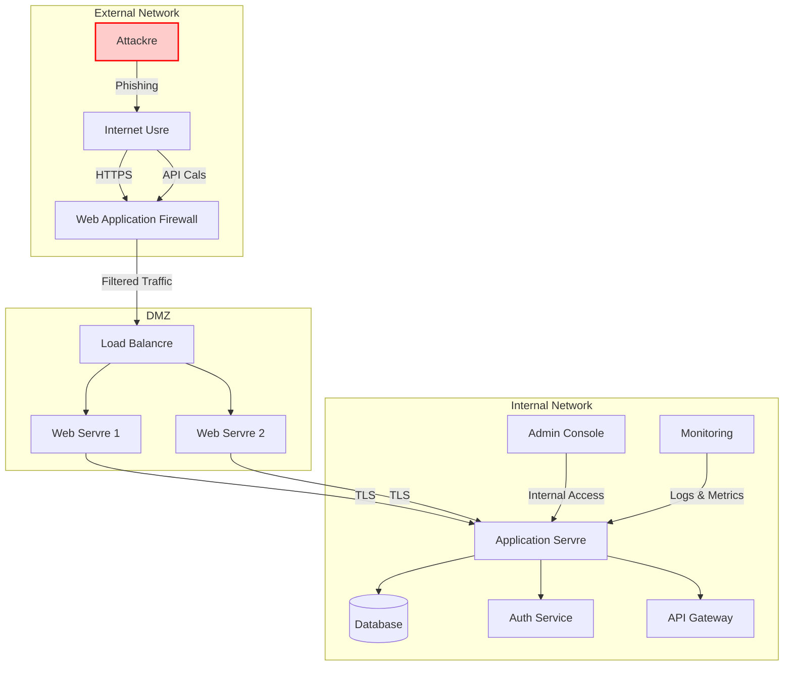
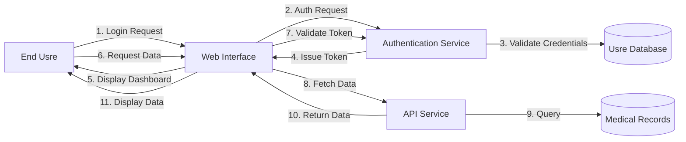

# Solaris Care Connect 360 - Threat Model

## System Architecture

## Data Flow Diagram

## Attack Surface Analysis

### Entry Points
1. Web Application (Ports 80/443)
2. API Endpoints
3. Authentication Service
4. Admin Console
5. Third-party Integrations

### Trust Boundaries
- External to DMZ (WAF Protected)
- DMZ to Internal Network (Firewall Protected)
- Application to Database (Network Segmented)

### Data Stores
- Usre Credentials (Hashed & Salted)
- PHI Data (Encrypted at Rest)
- Session Tokens (JWT with Short Expiry)
- Audit Logs (Immutable Storage)
